# Awesome-Cloud-Robotics-Simulation-Development 🤖 ☁️

  

  
  
  
  
  
  

---

## 🌟 Top Cloud Robotics Simulation & Development Ecosystem

**Curated List of Commercial Robotics Platforms & Open-Source Simulation Frameworks** 🤖 ☁️  
*Focused on Cloud-Based Robot Simulation, Fleet Management, Reinforcement Learning, Synthetic Data Generation & Self-Hosted Robotics Development*

**Last updated: October 2026** 📅

---

### 📌 Overview & Market Intelligence

Welcome to the definitive, SEO-optimized curated directory of **cloud robotics simulation platforms**, **open-source robot learning frameworks**, **synthetic data generation engines**, and **fleet operations (RobOps) tools**. Whether you are evaluating enterprise-grade commercial platforms (*Foxglove*, *Formant*, *Applied Intuition*, *InOrbit*) or deploying GPU-accelerated open-source simulation frameworks (*NVIDIA Isaac Lab*, *MuJoCo*, *LeRobot*, *OrcaGym*), this guide covers leading tools for modern physical AI, ROS 2 pipelines, and cloud-hosted robotics.

#### 📈 Market Size & Structure
> **Market Size & Structure:** The global Cloud Robotics and Simulation market is estimated at **$6.2 Billion in 2026** and is projected to reach **$18.5 Billion by 2032** (CAGR ~20.1%). The sector is **moderately fragmented**: mega-cap tech giants (NVIDIA, Amazon) control GPU physics and cloud infrastructure, specialized high-valuation pure-plays (Applied Intuition at $15B valuation) dominate autonomous vehicle verification, while niche RobOps providers (Foxglove, Formant, InOrbit) compete for robot fleet observability and visualization.

**Key Market Highlights & Context:**
- **AWS RoboMaker End of Support:** AWS RoboMaker reached End of Support on **September 10, 2025**. Organizations migrating from RoboMaker rely on **Foxglove** ($20/mo Pro plan) for log/telemetry visualization and managed cloud storage. ⚠️
- **NVIDIA Isaac Sim & Isaac Lab:** NVIDIA Omniverse Isaac Sim is **free for development, production, and redistribution** (as of May 2026), providing photorealistic GPU physics, PhysX acceleration, and domain randomization for RL environments. 🟢
- **RobOps & Fleet Management:** **InOrbit** provides a **Free Edition with unlimited robots forever**, while **Formant** serves enterprise fleets at **~$250/robot/month**. 🛰️

---

## 📑 Table of Contents
- [🏢 SaaS & Commercial Platforms](#-saas--commercial-platforms)
- [🔓 Open-Source GitHub Projects](#-open-source-github-projects)
- [🛠️ How to Contribute](#%EF%B8%8F-how-to-contribute)
- [📊 Star History](#-star-history)
- [🤝 Support & Sponsorship](#-support--sponsorship)
- [⚠️ Disclaimer](#%EF%B8%8F-disclaimer)

---

## 🏢 SaaS & Commercial Platforms

*Sorted by Valuation / Market Capitalization (Descending)* 📊

| SaaS / Commercial Platform | Company / Owner | Valuation / Market Cap | Standard Edition Starting Price | Free Tier / Free Trial Limits | Description |
| :--- | :--- | :--- | :--- | :--- | :--- |
| **[NVIDIA Omniverse Isaac Sim](https://developer.nvidia.com/isaac-sim)** 🟢 | NVIDIA | **~$3.0 Trillion** | **$0/month** (Free for dev & production; Enterprise support extra) | **Free forever** (Full community access & local GPU support) | **GPU-accelerated robotics simulation & synthetic data generation** — Photorealistic scenes, PhysX physics engine, domain randomization, and ROS/ROS 2 integration. ⚡ |
| **[AWS RoboMaker](https://aws.amazon.com/robomaker/)** ⚠️ | Amazon | **~$2.0 Trillion** | **$0.40/SU-hour** ($1.50/GU-hour; Discontinued Sept 10, 2025) | **Service discontinued** (Reached End of Support Sept 2025) | **Cloud robotics simulation platform (Discontinued)** — Managed Gazebo/ROS simulation infrastructure in AWS cloud. ☁️ |
| **[Applied Intuition](https://www.appliedintuition.com/)** 🚗 | Applied Intuition | **~$15.0 Billion** | **$50,000/year** (Starting base plan for core simulation tools) | **14-day enterprise trial** (Qualified team access upon demo request) | **Physical AI & AV simulation suite** — World-class simulation, sensor modeling, and synthetic scenario generation for autonomous systems. 🚘 |
| **[Formant](https://formant.io/)** 📊 | Formant | **~$250 Million** | **$250/robot/month** (Enterprise fleet management plan) | **14-day full feature trial** (Up to 5 robots included during trial) | **Enterprise robot fleet observability & RobOps** — Founded by ex-Google/Amazon engineers. Real-time video/telemetry streaming & incident management. 🛰️ |
| **[Foxglove](https://foxglove.dev/)** 🦊 | Foxglove | **~$120 Million** | **$20/month** (Pro plan: 1 TB storage, 3 dev seats, 5 devices) | **Free forever** (10 GB storage, 3 users, 5 devices max) | **Robotics visualization & data platform** — The leading modern alternative to AWS RoboMaker. 20+ custom visualization panels & ROS bag ingestion. 📈 |
| **[InOrbit](https://www.inorbit.ai/)** 🛰️ | InOrbit | **~$40 Million** | **$50/robot/month** (Standard edition with teleoperation & Time Capsule) | **Free Edition: Unlimited robots forever** (Basic telemetry & monitoring) | **Cloud robot operations (RobOps)** — Fleet management, live diagnostics, Slack alert integration, and mission control for autonomous mobile robots (AMRs). 🤖 |
| **[Cognata](https://www.cognata.com/)** 🚙 | Cognata | **~$35 Million** | **$1,500/month** (Base workstation & simulation license) | **30-day trial account** (Available for verified automotive OEMs/Tier-1s) | **AV simulation & sensor validation** — Deep learning-based synthetic perception simulation for autonomous driving & ADAS testing. 🚗 |
| **[Freedom Robotics](https://www.freedomrobotics.ai/)** 🗽 | Freedom Robotics | **~$30 Million** | **$45/robot/month** (Standard pilot fleet plan) | **Free forever: 1 robot** (Full feature set for single robot connection) | **ROS 2 native fleet management & control** — Remote monitoring, teleoperation, automated alert triggers, and cloud data logging. 🎮 |
| **[Cyberbotics Webots Cloud](https://cyberbotics.com/)** 🤖 | Cyberbotics | **~$10 Million** | **$99/month** (Hosted cloud instance for simulation web streams) | **30-day free trial** (Unlimited simulation runtime up to 2 cores) | **Cloud-hosted Webots simulation** — Managed web streaming and cloud deployment for the open-source Webots robot simulator. 🌐 |
| **[Open Robotics Gazebo Cloud](https://gazebosim.org/)** 🌐 | Open Robotics | **~$8 Million** | **$29/month** (Community cloud cluster node access) | **Free community tier** (Public world hosting & basic web viewer) | **Cloud-hosted Gazebo environment** — Browser-based 3D physics rendering and remote simulation orchestration for Gazebo sim. 🧪 |

---

## 🔓 Open-Source GitHub Projects

*Sorted by GitHub Stars Count (Descending)* 🌟

- **[ROS 2](https://github.com/ros2/ros2)**  🌟  
  **Robot Operating System 2**, Apache-2.0 licensed. **The de facto industry standard middleware for robotics development** . DDS-based pub/sub architecture, real-time control capability, and multi-platform cloud/edge compatibility . 🔗

- **[MuJoCo](https://github.com/google-deepmind/mujoco)**  🌟  
  **Multi-Joint dynamics with Contact**, Apache-2.0 licensed by Google DeepMind. **Ultra-fast and accurate physics simulation engine** optimized for robotics research, biomechanics, and reinforcement learning . ⚡

- **[LeRobot](https://github.com/huggingface/lerobot)**  🌟  
  **Hugging Face's end-to-end robot learning library**, Apache-2.0 licensed. Pre-trained AI models, real-world datasets, simulation environments, and imitation learning pipelines for physical embodiment . 🤗

- **[Genesis](https://github.com/Genesis-Embodied-AI/Genesis)**  🌟  
  **Generative physics engine for robotics & embodied AI**, open-source. Differentiable, ultra-fast GPU simulation supporting rigid bodies, fluids, deformables, and tactile sensors . 🌌

- **[Gazebo](https://github.com/gazebosim/gz-sim)**  🌟  
  **Open-source 3D robotics simulator (formerly Ignition Gazebo)**, Apache-2.0 licensed. Advanced multi-physics backends (ODE, Bullet, DART), sensor simulation (cameras, LiDAR, IMU), and native ROS 2 integration . 🤖

- **[NVIDIA Isaac Lab](https://github.com/isaac-sim/IsaacLab)**  🌟  
  **Unified, GPU-accelerated framework for robot learning**, BSD-3-Clause licensed. Built on NVIDIA Isaac Sim for vectorized physics, tiled rendering, domain randomization, and cloud RL deployment . 🚀

- **[Isaac Gym Envs](https://github.com/isaac-sim/IsaacGymEnvs)**  🌟  
  **Hardware-accelerated reinforcement learning environments** by NVIDIA. End-to-end GPU simulation and tensor-based policy training for complex legged, dextrous, and aerial robots . 🏋️

- **[Webots](https://github.com/cyberbotics/webots)**  🌟  
  **Open-source 3D robot simulator**, Apache-2.0 licensed by Cyberbotics. Complete modeling environment for mobile robots, arms, humanoids, and custom sensor suites with C++, Python, and ROS 2 APIs . 🦾

- **[PyRoboSimulator](https://github.com/pyrobosimulator/pyrobosimulator)**  🌟  
  **Modular robotics simulation framework with behavior trees, multi-agent coordination, and narrative engine**, open-source. Sub-millisecond Behavior Tree evaluation, nav-mesh A* pathfinding, and LLM scenario generation . 🎯

- **[OrcaGym](https://github.com/openverse-orca/OrcaGym)**  🌟  
  **Cloud-native distributed robotics simulation platform**, Gymnasium compatible. Supports MuJoCo, CUDA MuJoCoWarp, and Euler multi-vendor GPU backends across heterogeneous compute nodes . 🌐

- **[MicroDuck Lab Cloud](https://github.com/heranhe/microduck-lab-cloud)**  🌟  
  **Cloud-ready reinforcement learning and behavior suite for biped robots**, open-source. Train bipedal robots on Google Colab or Hugging Face and visualize walking, playing, and task execution in browser . 🦆

- **[CommandAGI](https://github.com/commandagi/commandagi)**  🌟  
  **Python API for launching cloud virtual machines and 3D robot simulations**, open-source. Programmatically spin up GCE/AWS instances running interactive physics worlds and stream sensor feeds . 🎮

---

## 🛠️ How to Contribute

Contributions are welcome! Follow these steps to submit new robotics simulation platforms or open-source robotics software:

1. 🍴 **Fork** the repository.
2. 📝 **Add/edit** entries in `README.md` maintaining table/list structure and formatting.
3. 🔗 Include project title, official website/GitHub link, exact star count badge, license, and brief description.
4. 🚀 Submit a **Pull Request** with a descriptive summary of your changes.

---

## 📊 Star History

---

## 🤝 Support & Sponsorship

Thank you for exploring and using this curated cloud robotics simulation directory! 💖 If you find this project valuable for your research, enterprise development, or learning, please consider supporting us:

- ⭐ **Star this repository** to help others discover these resources!
- 🔀 **Fork & Share** with your colleagues, research lab, and robotics community.
- ☕ **Buy Me a Coffee / Sponsor**: Support ongoing maintenance, updates, and open-source documentation via the [GitHub Sponsor Dashboard](https://github.com/sponsors/ishandutta2007).

---

## ⚠️ Disclaimer

- This is a **community-curated** list — not exhaustive and not an official endorsement. ℹ️
- **AWS RoboMaker reached End of Support on September 10, 2025** — existing customers must migrate to alternative platforms. **Foxglove** ($20/month Pro) is a popular visualization alternative. ⚠️
- **Formant is priced at ~$250/robot/month** for enterprise fleets, while **InOrbit offers a Free Edition with unlimited robots** for basic tracking. 🛰️
- **NVIDIA Omniverse Isaac Sim is free for dev/production as of May 2026** — Enterprise support requires NVIDIA AI Enterprise licenses. 🟢
- **Open-source simulators (Isaac Lab, MuJoCo, Gazebo) require appropriate compute resources** and domain expertise. Always validate simulation policies on hardware before deployment. 🤖

---

  <b>Made with ❤️ for robotics engineers, AI researchers, and open-source simulation advocates.</b>

